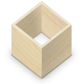
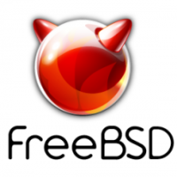

# Install

## Contents

+   [1 Operating system](#Operating_system)
    +   [1.1 Commercial](#Commercial)
    +   [1.2 GNU/Linux](#GNU/Linux)
    +   [1.3 Other Unix systems](#Other_Unix_systems)
+   [2 Other](#Other)

## Operating system

### Commercial

+   
    
    [Microsoft Windows](Windows.md "Octave for Microsoft Windows")
    
+   
    
    [macOS](macOS.md "Octave for macOS")
    

### [GNU/Linux](Linux.md "Octave for GNU/Linux")

+   **Distributions**

+   
    
    [Debian](Debian.md "Octave for Debian systems")
    
+   
    
    [Ubuntu](Debian.md "Octave for Debian systems")
    
+   Archlinux-vert-dark.svg
    
    [Arch Linux](ArchLinux.md "Octave for Arch Linux")
    
+   
    
    [Slackware](Slackware.md "Octave for Slackware")
    
+   
    
    [Gentoo](linux.md#Gentoo "Octave for GNU/Linux")
    
+   
    
    [Fedora](RedHat.md "Octave for Red Hat Linux systems")
    
+   
    
    [openSUSE](OpenSUSE.md "Octave for openSUSE")
    
+   
    
    [CentOS](RedHat.md "Octave for Red Hat Linux systems")
    
+   
    
    [RHEL](RedHat.md "Octave for Red Hat Linux systems")

+   **Distribution independent**

+   
    
    [Docker / Podman / Singularity](linux.md#Docker_.2F_Podman_.2F_Singularity "Octave for GNU/Linux")
    
+   
    
    [Flatpak](linux.md#Flatpak "Octave for GNU/Linux")
    
+   
    
    [Guix](linux.md#Guix "Octave for GNU/Linux")
    
+   
    
    [Homebrew](linux.md#Homebrew_on_Linux "Octave for GNU/Linux")
    
+   
    
    [MXE](MXE.html "MXE")
    
+   
    
    [Snap](linux.md#Snap "Octave for GNU/Linux")
    

### [Other Unix systems](unix.md "Octave for other Unix systems")

+   
    
    [Android](Android.md "Octave for Android")
    
+   
    
    [FreeBSD](unix.md "Octave for other Unix systems")
    
+   
    
    [OpenBSD](unix.md "Octave for other Unix systems")
    

## Other

+   
    
    [Jupyter](https://github.com/Calysto/octave_kernel)
    

## Pages in category "Installation"

The following 10 pages are in this category, out of 10 total.

### O

+   [Octave for Android](Android.md "Octave for Android")
+   [Octave for Arch Linux](ARchLinux.md "Octave for Arch Linux")
+   [Octave for Debian systems](Debian.md "Octave for Debian systems")
+   [Octave for GNU/Linux](linux.md "Octave for GNU/Linux")
+   [Octave for macOS](macOS.md "Octave for macOS")
+   [Octave for Microsoft Windows](Windows.md "Octave for Microsoft Windows")
+   [Octave for openSUSE](openSUSE.md "Octave for openSUSE")
+   [Octave for other Unix systems](unix.md "Octave for other Unix systems")
+   [Octave for Red Hat Linux systems](RedHat.md "Octave for Red Hat Linux systems")
+   [Octave for Slackware](Slackware.md "Octave for Slackware")

[Category](Special%253ACategories.html "Special:Categories"):

+   [Pages with broken file links](Category%253APages_with_broken_file_links.html "Category:Pages with broken file links")