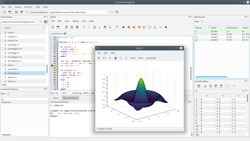
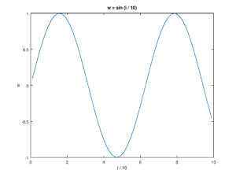

# 使用 Octave

首先，请按照以下操作系统的安装说明进行安装：

+   [macOS](../install/macOS.md "Octave for macOS")
+   [GNU/Linux](../install/Linux.md "Octave for GNU/Linux") 以及其他 [Unix 系统](../install/unix.md "Octave for other Unix systems")
+   [Microsoft Windows](../install/Windows.md "Octave for Microsoft Windows")

或者参考 [GNU Octave 手册](https://www.gnu.org/software/octave/doc/interpreter/Installation.html) 在您的系统上安装 GNU Octave。安装完成后，您可以通过点击程序菜单中的图标启动 GNU Octave，也可以在终端中输入 `octave` 启动交互式命令行界面。更多详情请参阅手册中关于 [运行 Octave](https://www.gnu.org/software/octave/doc/interpreter/Running-Octave.html) 的页面。



<!--[](File%253AGNU_Octave_screenshot.png.html "放大")-->

GNU Octave 图形用户界面（GUI）。

## 目录

+   [1 变量赋值](#变量赋值)
+   [2 注释](#注释)
+   [3 命令求值](#命令求值)
+   [4 基本数学运算](#基本数学运算)
+   [5 矩阵](#矩阵)
+   [6 线性代数](#线性代数)
+   [7 访问元素](#访问元素)
+   [8 循环控制流](#循环控制流)
+   [9 向量化](#向量化)
+   [10 绘图](#绘图)
+   [11 字符串](#字符串)
+   [12 条件语句（if-else）](#条件语句if-else)
+   [13 获取帮助](#获取帮助)
+   [14 Octave 软件包](#octave-软件包)
+   [15 Octave 用户代码](#octave-用户代码)

## 变量赋值

使用 `=` 将值赋给变量（注意：赋值采用 *值传递* 方式）。更多关于变量的信息，请参阅 [变量说明](https://www.gnu.org/software/octave/doc/interpreter/Variables.html)。

```octave
a = 1;
```

## 注释

`#` 或 `%` 开始一行注释，注释内容持续到该行末尾。更多关于注释的信息，请参阅 [注释说明](https://www.gnu.org/software/octave/doc/interpreter/Comments.html)。

## 命令求值

除非命令以分号 `;` 结尾，否则每条命令的输出都会打印到控制台。可以使用 [disp](https://www.gnu.org/software/octave/doc/interpreter/XREFdisp.html) 命令在任意位置打印输出。使用 [exit](https://www.gnu.org/software/octave/doc/interpreter/XREFquit.html) 或 [quit](https://www.gnu.org/software/octave/doc/interpreter/XREFquit.html) 退出控制台。更多关于命令求值的信息，请参阅 [简单示例](https://www.gnu.org/software/octave/doc/interpreter/Simple-Examples.html)。

```octave
t = 99 + 1  # 打印 't = 100'
```

```text
t =  100
```

```octave
t = 99 + 1; # 不会打印任何内容
disp(t);
```

```text
 100
```

## 基本数学运算

除了标准算术运算外，Octave 还提供许多其他数学运算符。所有运算均为浮点运算。更多关于基本数学运算的信息，请参阅 [算术运算](https://www.gnu.org/software/octave/doc/interpreter/Arithmetic.html)。

```octave
x = 3/4 * pi;
y = sin (x)
```

```text
y =  0.70711
```

## 矩阵

Octave 中的数组被称为矩阵。一维矩阵称为向量。使用空格或逗号 `,` 分隔同一行中的元素，使用分号 `;` 开始新行。更多关于矩阵的信息，请参阅 [线性代数](https://www.gnu.org/software/octave/doc/interpreter/Linear-Algebra.html)。

```octave
rowVec = [8 6 4]
```

```text
rowVec =
   8   6   4
```

```octave
columnVec = [8; 6; 4]
```

```text
columnVec =
   8
   6
   4
```

```octave
mat = [8 6 4; 2 0 -2]
```

```text
mat =
   8   6   4
   2   0  -2
```

```octave
size(mat)
```

```text
ans =
   2   3
```

```octave
length(rowVec)
```

```text
ans =  3
```

## 线性代数

使用 Octave 的矩阵语法，可以轻松实现许多常见的线性代数运算。更多关于线性代数的信息，请参阅 [线性代数](https://www.gnu.org/software/octave/doc/interpreter/Linear-Algebra.html)。

```octave
columnVec * rowVec
```

```text
ans =
   64   48   32
   48   36   24
   32   24   16
```

```octave
rowVec * columnVec
```

```text
ans =  116
```

```octave
columnVec'
```

```text
ans =
   8   6   4
```

## 访问元素

Octave 的索引从 1 开始。矩阵元素通过 `matrix(行号, 列号)` 访问。更多关于访问元素的信息，请参阅 [索引表达式](https://www.gnu.org/software/octave/doc/interpreter/Index-Expressions.html)。

```octave
mat(2,3)
```

```text
ans = -2
```

## 循环控制流

Octave 支持 `for` 和 `while` 循环，以及其他控制流结构。更多关于控制流的信息，请参阅 [语句](https://www.gnu.org/software/octave/doc/interpreter/Statements.html)。

```octave
x = zeros (50,1);
for i = 1:2:100 # 从 1 到 100，步长为 2 进行迭代
  x(i) = i^2;
endfor

y = zeros (50,1);
k = 1;
step = 2;
while (k <= 100)
  y(k) = k^2;
  k = k + step;
endwhile
```

## 向量化

通常可以使用向量语法替代或简化 for 循环。在运算符 `*`、`/` 和 `^` 前加上点 `.`，即可执行逐元素运算。许多其他函数（如 [sin](https://www.gnu.org/software/octave/doc/interpreter/XREFsin.html)、`+`、`-` 等）默认即为逐元素操作。更多关于向量化的信息，请参阅 [向量化与加速代码执行](https://www.gnu.org/software/octave/doc/interpreter/Vectorization-and-Faster-Code-Execution.html)。

```octave
i = 1:2:100;      # 创建一个包含 50 个元素的数组
x = i.^2;         # 对每个元素平方
y = x + 9;        # 每个元素加 9
z = y./i;         # 将 y 中每个元素除以 i 中对应的值
w = sin (i / 10); # 对每个元素除以 10 后取正弦值
```

## 绘图

调用 [plot](https://www.gnu.org/software/octave/doc/interpreter/XREFplot.html) 函数并传入向量参数，即可创建二维折线图或散点图。更多关于绘图的信息，请参阅 [二维绘图](https://www.gnu.org/software/octave/doc/interpreter/Two_002dDimensional-Plots.html)。

```octave
plot (i / 10, w);
title ('w = sin (i / 10)');
xlabel ('i / 10');
ylabel ('w');
```



<!--[](File%253AUsing_octave-1.png.html "放大")-->

## 字符串

字符串本质上是字符数组。可以使用 C 风格的格式化函数 [sprintf](https://www.gnu.org/software/octave/doc/interpreter/XREFsprintf.html) 或 [fprintf](https://www.gnu.org/software/octave/doc/interpreter/XREFfprintf.html) 构造字符串。更多关于字符串的信息，请参阅 [字符串](https://www.gnu.org/software/octave/doc/interpreter/Strings.html)。

```octave
firstString = "hello world";
secondString = "!";
[firstString, secondString] # 连接两个字符串
```

```text
ans = hello world!
```

```octave
fprintf ("%s %.10f \n", "The number is:", 10)
```

```text
The number is: 10.0000000000
```

## 条件语句（if-else）

条件语句可用于在代码中实现分支逻辑。更多详情请参阅手册中的 [if 语句](https://www.gnu.org/software/octave/doc/interpreter/The-if-Statement.html)。

```octave
# 若能被 7 整除，打印 'Foo'；
# 若能被 3 整除，打印 'Fizz'；
# 若能被 5 整除，打印 'Buzz'；
# 若能同时被 3 和 5 整除，打印 'FizzBuzz'
for i = 1:1:20
  outputString = "";
  if (rem (i, 3) == 0)  # rem 是取余函数
    outputString = [outputString, "Fizz"];
  endif
  if (rem (i, 5) == 0)
    outputString = [outputString, "Buzz"];
  elseif (rem(i,7) == 0)
    outputString = "Foo";
  else
    outputString = outputString;
  endif
  fprintf("i=%g: %s \n", i, outputString);
endfor
```

```text
i=1:  
i=2:  
i=3: Fizz 
i=4:  
i=5: Buzz 
i=6: Fizz 
i=7: Foo 
i=8:  
i=9: Fizz 
i=10: Buzz 
i=11:  
i=12: Fizz 
i=13:  
i=14: Foo 
i=15: FizzBuzz 
i=16:  
i=17:  
i=18: Fizz 
i=19:  
i=20: Buzz
```

## 获取帮助

在 Octave 提示符下，可以使用 [help](https://www.gnu.org/software/octave/doc/interpreter/XREFhelp.html) 和 [doc](https://www.gnu.org/software/octave/doc/interpreter/XREFdoc.html) 命令打印任意函数的文档。

```octave
help plot
doc plot
```

## Octave 软件包

可以从 [Octave Packages](https://gnu-octave.github.io/packages/) 网站添加社区开发的软件包，以扩展 Octave 核心库的功能。（MATLAB 用户注意：这些软件包类似于 MATLAB 的工具箱。）使用 [pkg](https://www.gnu.org/software/octave/doc/interpreter/XREFpkg.html) 命令管理这些软件包。例如，若要使用图像处理库，请访问其在 [Octave Packages 上的页面](https://gnu-octave.github.io/packages/image/)，复制安装命令并在 Octave 中运行：

```octave
pkg install "https://downloads.sourceforge.net/project/octave/Octave%20Forge%20Packages/Individual%20Package%20Releases/image-2.14.0.tar.gz" # 安装软件包
pkg load image           # 将新函数加载到工作空间
```

[了解更多关于软件包的信息](https://www.gnu.org/software/octave/doc/interpreter/Packages.html)。

## Octave 用户代码

此外，还有不属于核心程序或任何软件包的 GNU Octave 用户代码。

[参见 用户代码分类](Category%253AUser_Codes.html "Category:User Codes")。

[分类](Special%253ACategories.html "Special:Categories"):

+   [教程](Category%253ATutorials.html "Category:Tutorials")